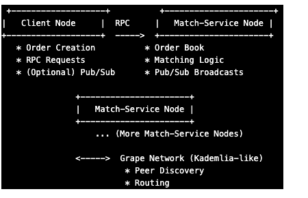

## P2P Order Matching Service

This project implements a distributed, peer-to-peer (P2P) order matching engine for a hypothetical cryptocurrency exchange.  At its core, it leverages the power of Grenache and Kademlia-based distributed networking for robust communication and efficient peer discovery.

### Key Features

- Decentralized Matching:  Order matching occurs directly between peers in the network, bypassing the need for a centralized exchange and reducing potential points of failure.

- Kademlia-Based Peer Discovery: The system utilizes Kademlia-like algorithms via the Grape network to enable peers to efficiently find and connect with each other.

- Load Balancing: Requests and publish/subscribe events are balanced across the peer network, enhancing scalability and resilience.

- Multi-Package Architecture: The project is thoughtfully organized into these packages:

client: Provides functionality for users to create and submit orders.
common: Houses shared interfaces and constants used across the system.
match-service: Contains the core order book management and order matching logic.
Technical Details

Grenache:  Serves as the foundation for peer-to-peer communication, providing:

RPC (Remote Procedure Calls): Facilitates direct requests between peers (e.g., a client requesting the best available prices from a match-service peer).
Pub/Sub (Publish/Subscribe): Enables broadcasting of order matching events and order book updates for real-time synchronization across the network.
Grape: A discovery and announcement layer built on top of Grenache, implementing Kademlia-like principles for peer discovery and distributed routing.

 

### Benefits of a P2P Approach

- Resilience: The decentralized nature makes the system less susceptible to single points of failure.
- Scalability: The load is distributed across multiple peers, allowing for better handling of increased volume.
- Reduced Latency: Direct peer-to-peer communication can potentially decrease order matching and update propagation times.
-  Potential for Censorship Resistance: Depending on the implementation, the lack of a central authority can provide greater control for users.

### Architecture
![Alt Text] (docs/p2p-order-matching-architecture.png)
The flow starts with the client querying for the order handling node through the Grenache library, which in turn communicates with the Kademlia DHT to find the appropriate node. Once the node IP is returned to the client, an RPC request is made directly to the node to process the order, and the node sends back an acknowledgment or response to the client.

### Heartbeat
![Alt Text] (docs/p2p-order-matching-heartbeat.png)
The order matching service periodically sends heartbeats to Kademlia, to announce it's active and processing orders.

### MultiRepo
There are 3 repos.
Client -> This could be your express server accepting requests from frontend
Common -> Having utils, interfaces etc
Order Service -> Microservice talking to Kademlia.